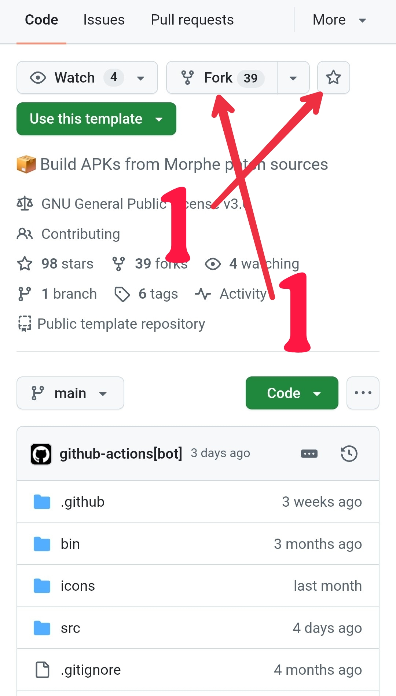
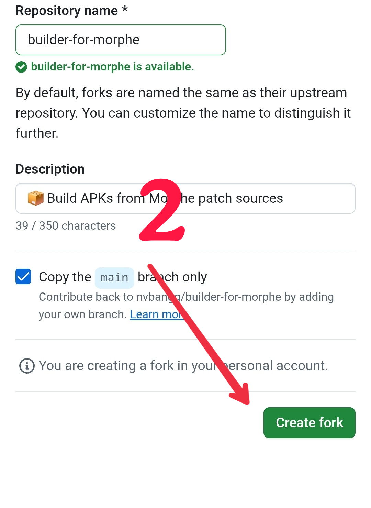
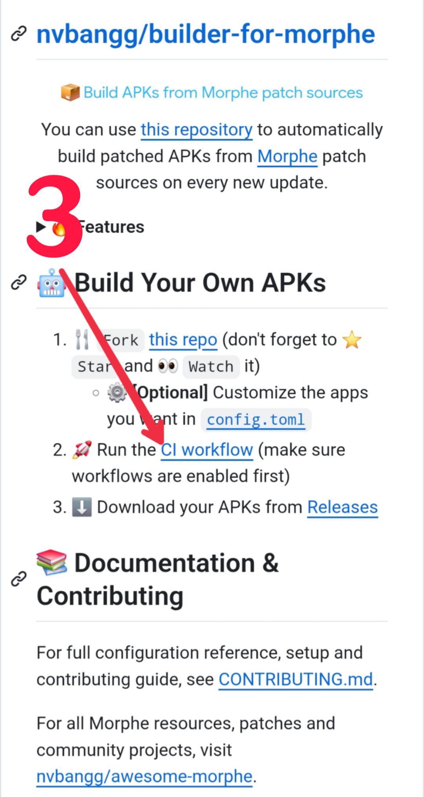
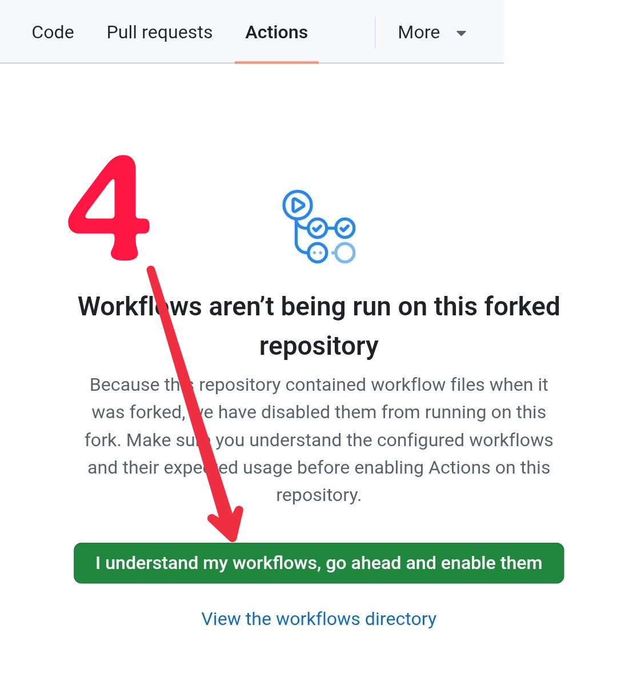
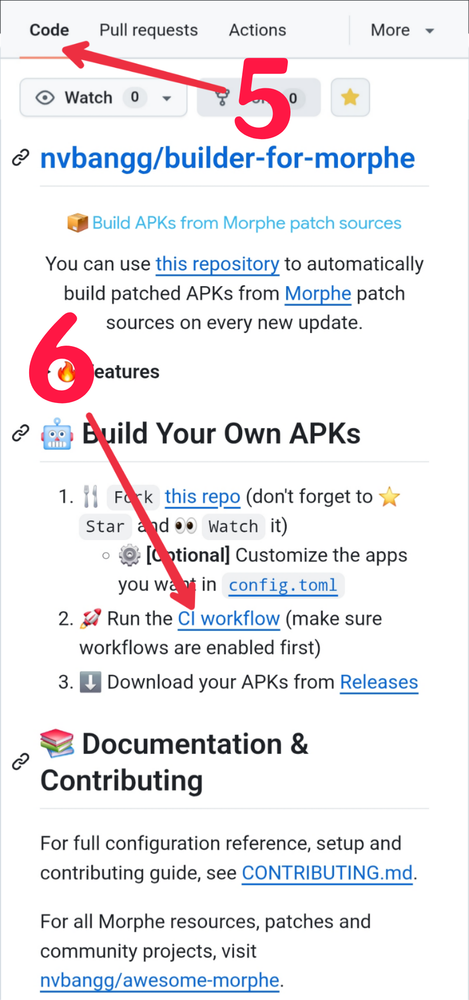
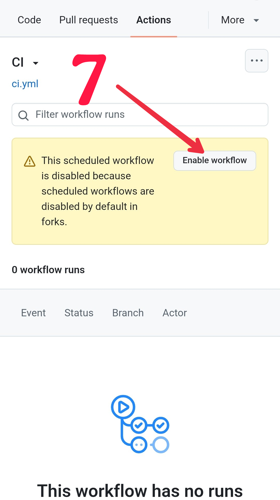
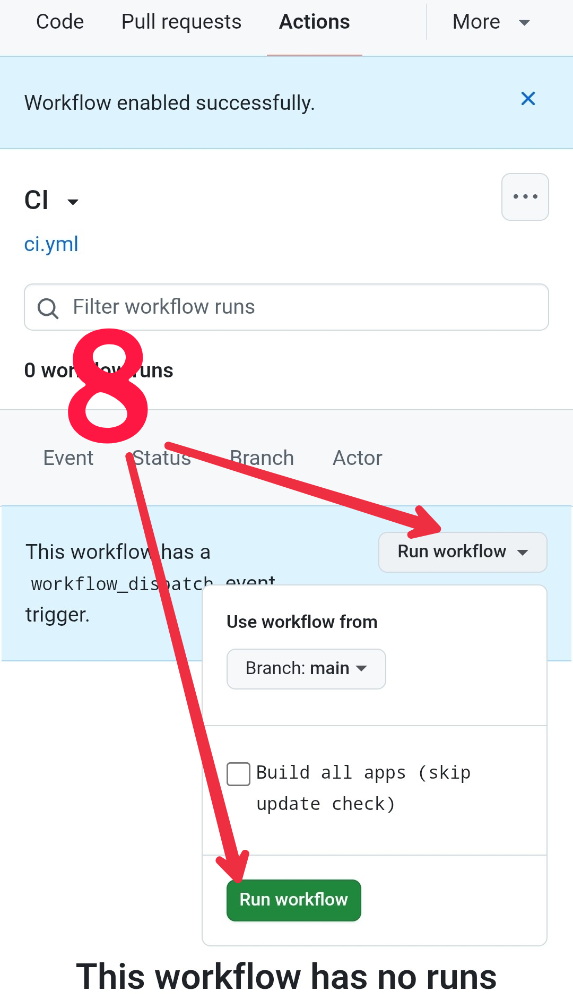
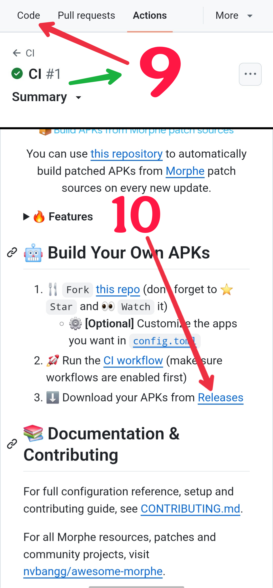
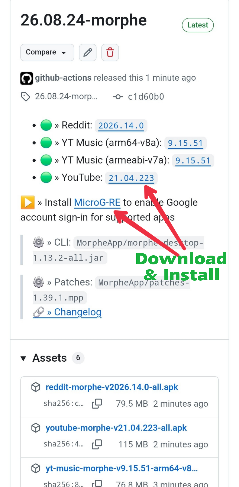
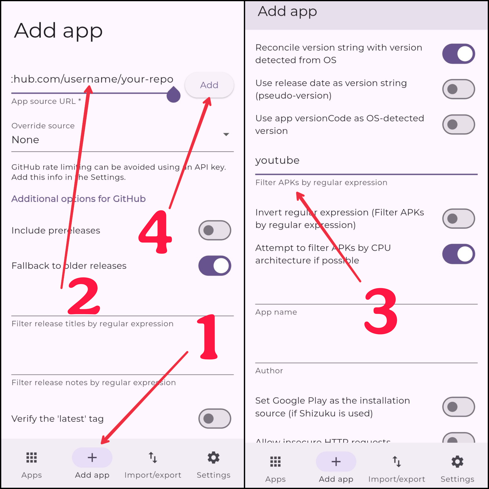

# Syntrophe

*The automated compilation engine powering [Apostrophe](https://ostrophe.vercel.app/).*

**Syntrophe** (Stratophe) is the backend builder repository for the Apostrophe project. It utilises GitHub Actions to automatically fetch, patch, and compile Android applications, which are then distributed directly to the main user-facing hub.

## ⚙️ Core Features

*   **Automated Pipeline:** Uses robust CI/CD workflows to build patched APKs automatically upon new upstream updates.
*   **Centralised Configuration:** Manage included apps, targeted patches, and build parameters directly through a clean `config.toml` file.
*   **Persistent Signatures:** Ensures patched applications can be updated seamlessly via Obtainium without being overwritten by the Play Store.
*   **Optimised Footprint:** Produces binaries stripped of unnecessary telemetry and bloat for maximum performance.
*   **Automatic Upstream Sync:** Pulls in bug fixes, scraper updates, and new patch sources while preserving your custom configuration.

## 🏗️ How It Works

This repository does not host pre-patched APKs directly in its source code. Instead, it operates as a factory pipeline:
1.  **Fetch:** Retrieves unmodified base APKs from secure, open-source repositories.
2.  **Patch:** Applies selected modifications (such as ad-blocking, enhanced privacy modules, and premium feature unlocking).
3.  **Deploy:** Compiles, signs, and pushes the final APKs securely to GitHub Releases.

## 🔗 The Ecosystem

Syntrophe serves strictly as the builder layer. To browse, download, and manage the compiled applications through a modern glassmorphic interface, visit the frontend hub:

*   **App Hub:** [Apostrophe](https://ostrophe.vercel.app/)
*   **Frontend Repository:** [Adish08/Apostrophe](https://github.com/Adish08/Apostrophe)

## 🤖 Build Your Own APKs

1. 🍴 `Fork` [this repo](https://github.com/Adish08/Syntrophe) (don't forget to ⭐ `Star` and 👀 `Watch` it)
   - ⚙️ **[Optional]** Customize the apps you want in [`config.toml`](config.toml)
2. 🚀 Run the [CI workflow](../../actions/workflows/ci.yml) (make sure workflows are enabled first)
3. ⬇️ Download your APKs from [Releases](../../releases)

<b>⬇️ Step-by-step Visual Guide</b>

 

<b>🔄 Obtainium Setup Visual Guide</b>

 

In step 3, enter the APK prefix (e.g. `youtube`, `yt-music`, `x-twitter`, etc.) to filter the app you want.

For full configuration reference, setup and contributing guide, see [CONTRIBUTING.md](CONTRIBUTING.md).

For all Morphe resources, patch bundles and community projects, visit [nvbangg/awesome-morphe](https://github.com/nvbangg/awesome-morphe).

## 👏 Acknowledgments

This infrastructure relies on robust open-source foundations. Special thanks to:
*   [nvbangg](https://github.com/nvbangg/builder-for-morphe) for the upstream automated builder repository.
*   **j-hc** for laying down the initial Python rewrite foundation.
*   The broader open-source community for maintaining the patches that fuel this ecosystem.

## ⚠️ Disclaimer

- This project is intended for educational and research purposes only.
- All builds are executed using publicly available tools via transparent GitHub Actions. Syntrophe is not affiliated with the original application developers, Morphe, or the patch creators.
- This repository does not provide pre-patched APKs; it is only a tool to conveniently compile publicly available patch bundles. Please use responsibly and ensure you trust the sources of your patches.

<h3>⚖️ License & Copyright</h3>

This project is open-source and distributed under the **[GNU GPLv3](LICENSE)** license. You are free to use, modify, and redistribute this software, but you **must** keep all original and new copyright notices intact.

> **Copyright (C) 2026 [nvbangg](https://github.com/nvbangg)** (for all [modifications](https://github.com/nvbangg/builder-for-morphe/commits/main/?author=nvbangg) by nvbangg in [builder-for-morphe](https://github.com/nvbangg/builder-for-morphe), and those in [contributions](https://github.com/krvstek/uni-apks/commits/main/?author=nvbangg) and [co-authored commits](https://github.com/search?q=repo%3Akrvstek%2Funi-apks+Co-authored-by%3A+nvbangg&type=commits))  
> **Copyright (C) 2026 [krvstek](https://github.com/krvstek)** (for the original [uni-apks](https://github.com/krvstek/uni-apks) codebase)  
> **Authors:** See the list of [Contributors](https://github.com/nvbangg/builder-for-morphe/graphs/contributors) for their source code contributions, and see [icons/README.md](icons/README.md) for asset sources.

---
*Maintained with ❤️ for the Apostrophe ecosystem.*
